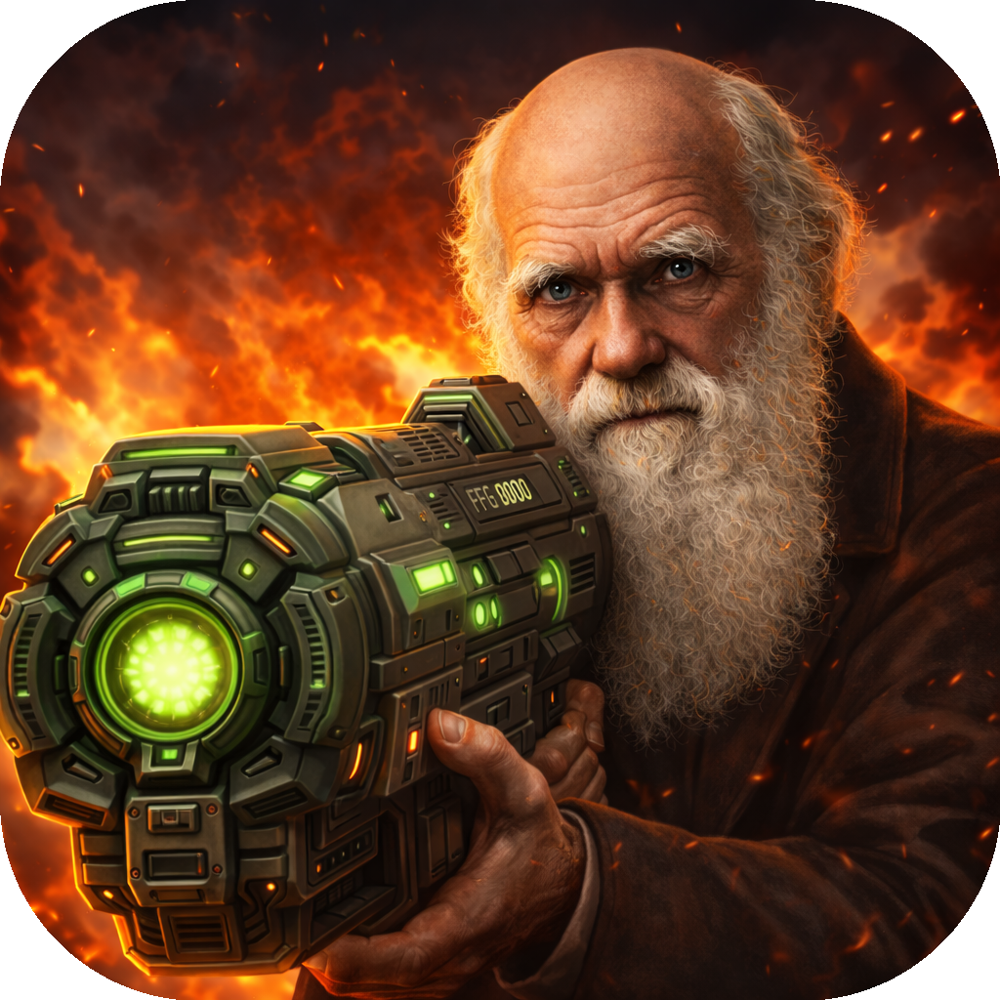
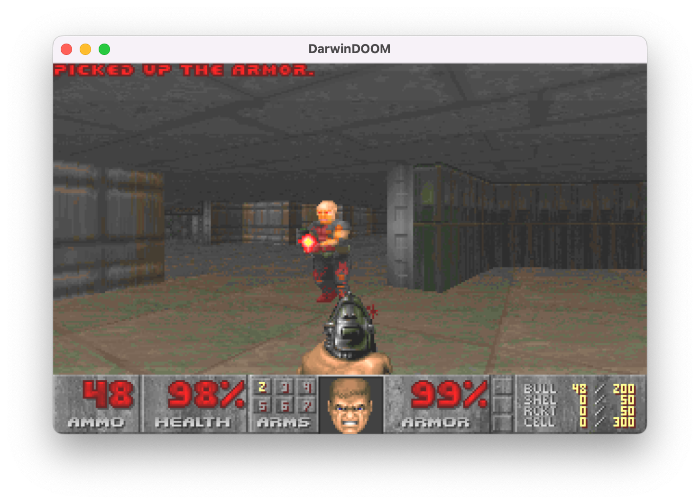
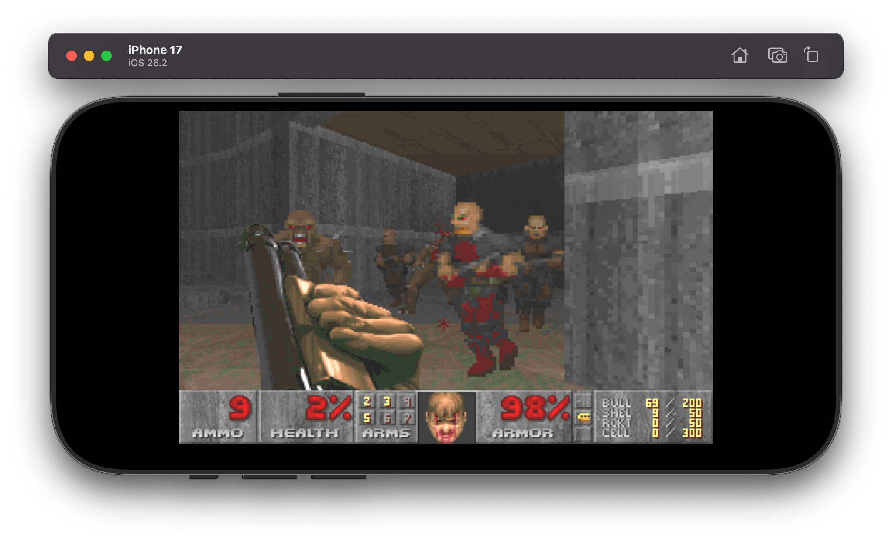
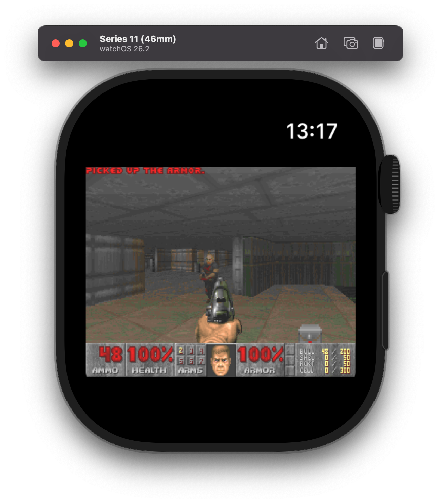
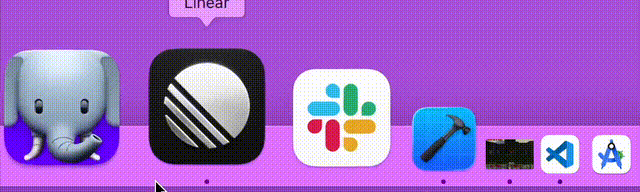

# DarwinDOOM


## What is this?

The goal of this project is to take [doomgeneric](https://github.com/ozkl/doomgeneric) and port it over to Apple devices. This started as a weekend hack and then got a boost from LLMs.

[YouTube video of it running on an Apple Watch.](https://youtube.com/shorts/Z2bWLXOEflI)

| macOS | iOS | watchOS |
| - | - | - |
|  |  |  |





## Features

- macOS has sound via AVFoundation (SFX + MIDI music).
- iOS has sound via AVFoundation (SFX + MIDI music; uses bundled soundfont). Note: the iOS Simulator's MIDI instruments can sound rough; on-device playback is fine.
- watchOS: experimental SFX sound scaffolding (AVFoundation). Music is disabled for now.
- macOS includes an optional Face Control mode (menu bar toggle) that uses the camera to drive the Doom Guy’s face.
  Supported expressions: forward, look left, look right, grin, mouth open, eyebrow raise (left), eyebrow raise (right).
- macOS can render DOOM in the Dock when the window is minimized (menu bar toggle: "Render in Dock").

## Setup (macOS)

1) (Optional) Replace the bundled shareware WAD by dropping another WAD into `DarwinDOOM/WADs`.

2) Build and run in Xcode.

## Release (macOS)

The release flow is interactive and prompts you for:
- Confirming the version you passed in.
- Whether to notarize the build.
- Whether to create a GitHub tag + draft release.

Versioning is centralized in `Config/Versions.xcconfig` and will be updated to match the release version.
If that change produces a git diff, you’ll be prompted to commit it.

Before notarizing, create a keychain profile once:

```
xcrun notarytool store-credentials "DarwinDOOM-notary" --apple-id "<you@example.com>" --team-id AE76EV48ND --password "<app-specific-password>"
```

Run a release:

```
make release VERSION=0.1.0
```


## Controls

iOS and Watch apps have touch controls.

The full screen is divided into a 3x3 grid:

```
left  |  up  |  right 
----------------------
left  |  up  |  right
----------------------
action | down | fire
----------------------
```

**Action** changes based on game state: ENTER (Menu) or USE (In-Game)

**Fire** also changes based on game state: ESCAPE (Menu) or FIRE (In-Game)

Keyboard controls (macOS + iOS with a hardware keyboard):
- Arrow keys: move/turn
- Control: fire
- Space: fire (or space when typing)
- E: use (or "e" when typing)
- Enter: menu/select
- Escape: back
- Tab: automap
- Shift: run
- Backspace: backspace when typing

Controls can be adjusted in `TouchToKeyManager.swift`.
